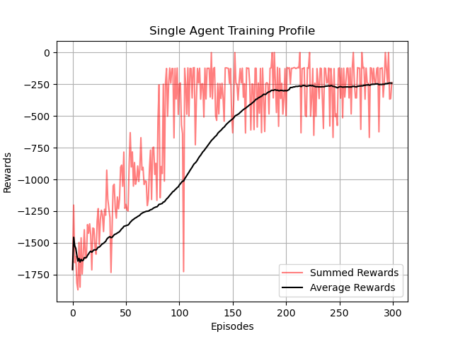

# Solving [openai-gym](https://gym.openai.com/) Puzzles using Cooperative Deep RL Multi-Agents 

This repository implements multiple Deep-RL agents to solve an 'openai-gym' puzzle. The idea is to share agent learned parameters to solve the puzzle ASAP!

## Strategy

1. Pool & share all the agent's Experience Replay Buffer.
2. Transfer the best agent's with other agents every episode.
3. All the agent's are TD3 & initialized with same parameters.

## Single Agent

|Training Profile|
|:--:|
||

## Multiple Agent

|'agent1' Training Profile|'agent2' Training Profile|
|:--:|:--:|
|||

|'agent3' Training Profile|
|:--:|
||

## Collective Result Analysis

|Collective Training Profile| Solo & Team Agent Testing Profile| 
|:--:|:--:|
|||

## Results

1. Single Agent Sum.Score = -22712.6309     
2. Multi Agent Sum.Score = -10695.2879
3. Single Agent Mean Score = -227.1263   
4. Multi Agent Mean Score = -106.9528
5. Scores in Ratio :
    Single Agent : Multi Agent = 0.4708
    Multi Agent : Single Agent = 2.1236

** 3Nos. of agents in a team are 2.2136 times better than a single agent.

## Developer

* Name: Kanishk Navale
* Website: https://kanishknavale.github.io/
* E-Mail: navalekanishk@gmail.com

